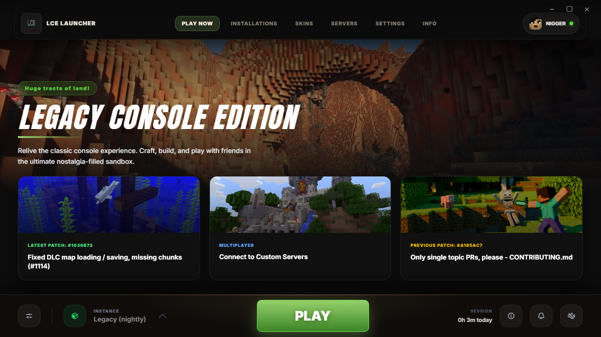

# LCE Launcher

LCE Launcher is a custom launcher for Minecraft Legacy Console Edition preservation and community builds. It focuses on fast instance management, clean updates, and a cozy nostalgic UI.

## Features

- Minecraft-inspired UI with modern polish
- Instance management for multiple installs
- GitHub release fetching for game builds
- Custom servers list management
- Profile with username + playtime tracking
- Announcements and patch notes view
- Background video and music controls
- Auto-update support for packaged builds (GitHub Releases)

## Downloads

Download The Latest Release [Here](https://github.com/Jaruwyd/LCE-Launcher/releases/tag/0.0.1)

## Configuration

### Repository Source
By default, the launcher fetches releases from `smartcmd/MinecraftConsoles`. You can change this in the Settings menu.

### Launch Options
- GitHub repository for game releases
- Executable name (default: `Minecraft.Client.exe`)
- Compatibility layer (Linux) for running Windows builds
- Optional server IP/port

### Profile
- Username (stored locally)
- Playtime tracking

## Auto-Updates

Packaged builds can auto-update via GitHub Releases. During launch, the app checks for new releases, downloads updates, and installs automatically.

## To Do
- Add Mod Loader
- Add Friends Tab
- Add Discord RPC
- Add LCEMP Support

## W.I.P
- Fix Server World's To Actually Save Properly

## Credits

- **Jaruwyd / nt8j** — Launcher Creator  
  https://github.com/Jaruwyd
- **smartcmd** — Legacy (Nightly) Build Version  
  https://github.com/smartcmd/MinecraftConsoles
- **gradenGnostic** - Launcher Inspo
  https://github.com/gradenGnostic/LegacyLauncher
 
## Help & Links

If you need any help in-game, join the Minecraft Consoles Discord server:  
https://discord.gg/minecraftconsoles

## License

ISC
